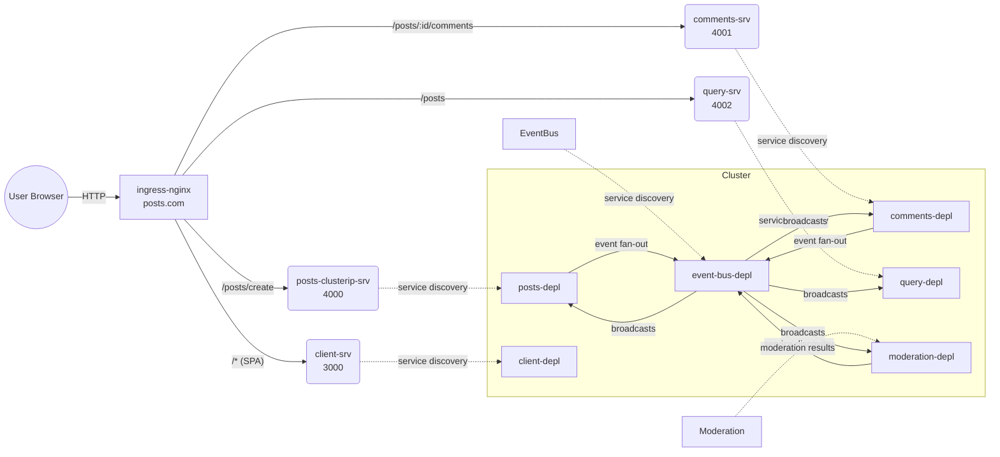

# Kubernetes Infrastructure

This document explains the Kubernetes objects defined in [infra/k8s](infra/k8s), how pods, services, and the ingress fit together, and what that means for running the system locally and in the cloud.

## Workloads (Deployments)
Each service runs as a single-replica Deployment with its own image:
- UI: [infra/k8s/client-depl.yaml](infra/k8s/client-depl.yaml) → image `haryati75/client`, exposed on 3000.
- Posts API: [infra/k8s/posts-depl.yaml](infra/k8s/posts-depl.yaml) → image `haryati75/posts`, exposed on 4000.
- Comments API: [infra/k8s/comments-depl.yaml](infra/k8s/comments-depl.yaml) → image `haryati75/comments`, exposed on 4001.
- Query API: [infra/k8s/query-depl.yaml](infra/k8s/query-depl.yaml) → image `haryati75/query`, exposed on 4002.
- Moderation worker: [infra/k8s/moderation-depl.yaml](infra/k8s/moderation-depl.yaml) → image `haryati75/moderation`, exposed on 4003.
- Event bus: [infra/k8s/event-bus-depl.yaml](infra/k8s/event-bus-depl.yaml) → image `haryati75/event-bus`, exposed on 4005.

## Services (networking inside the cluster)
- ClusterIP (internal only):
  - [infra/k8s/posts-depl.yaml](infra/k8s/posts-depl.yaml) defines `posts-clusterip-srv` on 4000. Ingress routes write traffic here.
  - [infra/k8s/comments-depl.yaml](infra/k8s/comments-depl.yaml) → `comments-srv` on 4001.
  - [infra/k8s/query-depl.yaml](infra/k8s/query-depl.yaml) → `query-srv` on 4002.
  - [infra/k8s/moderation-depl.yaml](infra/k8s/moderation-depl.yaml) → `moderation-srv` on 4003.
  - [infra/k8s/event-bus-depl.yaml](infra/k8s/event-bus-depl.yaml) → `event-bus-srv` on 4005.
  - [infra/k8s/client-depl.yaml](infra/k8s/client-depl.yaml) → `client-srv` on 3000.
- NodePort (legacy/local escape hatch):
  - [infra/k8s/posts-srv.yaml](infra/k8s/posts-srv.yaml) exposes posts on a random node port. Ingress does not use it; it can be useful for quick local testing or port-forwarding but can be removed in hardened environments.

## Ingress (edge routing)
- Defined in [infra/k8s/ingress-srv.yaml](infra/k8s/ingress-srv.yaml) using the NGINX Ingress controller (`ingressClassName: nginx`).
- Host: `posts.com` with path-based routing:
  - `/posts/create` → `posts-clusterip-srv` (4000)
  - `/posts` → `query-srv` (4002)
  - `/posts/:id/comments` (regex) → `comments-srv` (4001)
  - all other paths → `client-srv` (React SPA on 3000)
- Path order matters; the most specific rules are declared first.

### Traffic topology (Mermaid)

## Running locally (e.g., minikube or kind)
- Install ingress-nginx in the cluster (`minikube addons enable ingress` or equivalent). The `ingressClassName` must match the controller.
- Apply manifests: `kubectl apply -f infra/k8s` (or use Skaffold if configured).
- Map `posts.com` to the ingress IP (for minikube: `minikube ip` and add a hosts entry; for kind: use the ingress controller service address or port-forward it).
- Images `haryati75/*` must be available to the cluster (pull from Docker Hub or load locally with `minikube image load` / `kind load docker-image`).
- For quick debugging without ingress, you can `kubectl port-forward svc/posts-clusterip-srv 4000:4000` etc., or use the NodePort service from [infra/k8s/posts-srv.yaml](infra/k8s/posts-srv.yaml).

## Running in the cloud
- Use the same manifests; ensure an ingress-nginx (or cloud ingress controller) is installed and recognizes `ingressClassName: nginx` (or adjust the class name to your controller).
- `posts.com` must resolve to the ingress controller’s external IP or load balancer. Consider automating DNS with external-dns and using TLS via cert-manager.
- Replace or disable the NodePort service if using a managed ingress; keep only ClusterIP services behind the ingress.
- Scale replicas by editing Deployment `replicas`; add resource limits and readiness/liveness probes for production hardening.
- Ensure the container registry is reachable (push `haryati75/*` images to a cloud registry if private clusters cannot pull Docker Hub directly).
