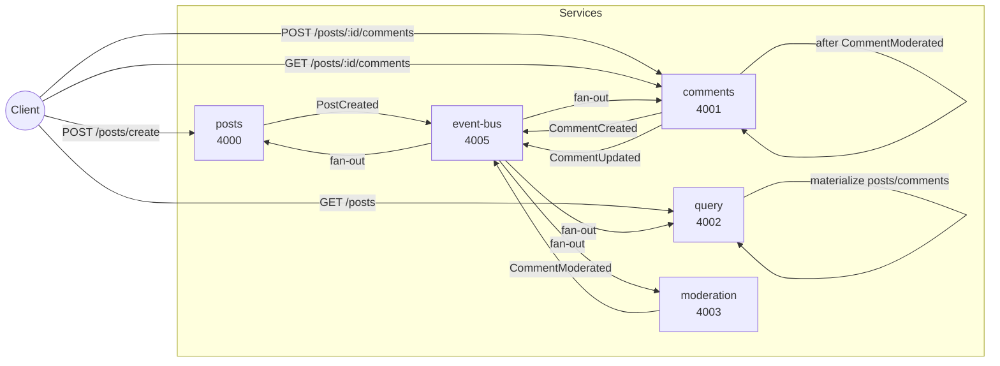

# Service Communications

This document summarizes how each backend microservice exchanges HTTP requests and domain events in the blog system. All inter-service traffic is HTTP over the internal cluster network.

## Services and roles
- **posts (4000)**: accepts new posts, emits `PostCreated`.
- **comments (4001)**: accepts new comments, emits `CommentCreated`; handles moderation outcomes and emits `CommentUpdated`.
- **moderation (4003)**: evaluates comments and emits `CommentModerated`.
- **query (4002)**: materialized read model; handles `PostCreated`, `CommentCreated`, and `CommentUpdated`; exposes aggregated `GET /posts`.
- **event-bus (4005)**: fan-out dispatcher; stores event history; forwards every event to posts, comments, query, and moderation.

## REST entrypoints
- posts: `POST /posts/create` (create post; emits `PostCreated`).
- comments: `POST /posts/:id/comments` (create comment; emits `CommentCreated`), `GET /posts/:id/comments` (read comments for a post).
- query: `GET /posts` (read posts with comments and statuses).
- event-bus: `GET /events` (history for rebuilding state), `POST /events` (internal fan-out).

## Event flow
1. Client creates a post → posts service emits `PostCreated` to event-bus.
2. Client adds a comment → comments service emits `CommentCreated` to event-bus.
3. event-bus fans out all events to posts, comments, query, and moderation.
4. moderation processes `CommentCreated` → emits `CommentModerated` (approved/rejected) to event-bus.
5. comments handles `CommentModerated` → updates local comment status → emits `CommentUpdated` to event-bus.
6. query consumes `PostCreated`, `CommentCreated`, `CommentUpdated` → maintains read model served at `GET /posts`.

## Startup behavior
- query rebuilds state by fetching the full event history from event-bus via `GET /events` and replays every event.
- other services currently only log incoming events.

## Mermaid visualization

## Notes and gaps
- posts service still exposes `GET /posts` but the read model is served by query; consider removing or securing the old endpoint.
- event-bus logs rejected fan-out results; consider alerting/metrics for failures.
- moderation uses a simple content check (`orange`) to reject comments; adjust rules as needed.
